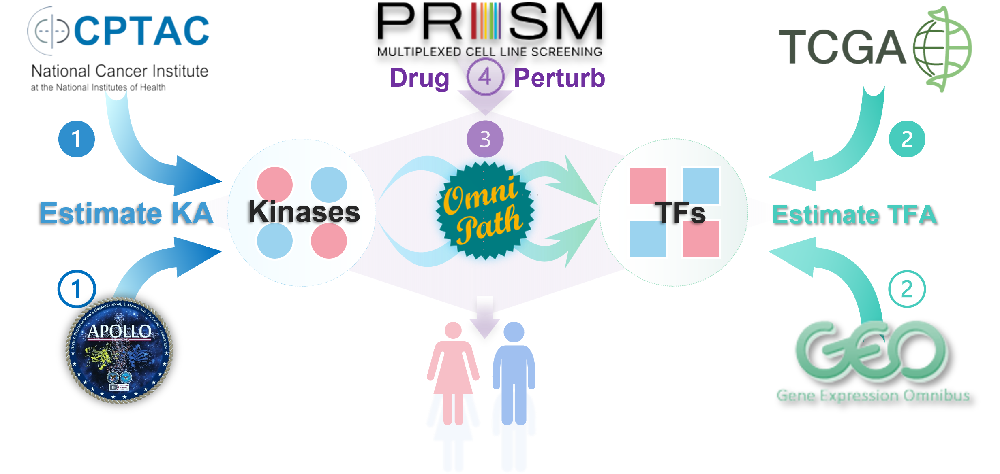

# Sex_Difference_LUAD_Code
This repository contains code for reproducing the results and figures presented in the paper "Identifying Sex Differences in Lung Adenocarcinoma Using Multi-Omics Integrative Protein Signaling Networks." 
 

### Dependencies
R version 4.3.0 or later is required. Below are the R package version requirements:

  
Click to view full package dependencies

|Package              |Version    |
|:--------------------|:----------|
|dplyr                |1.1.2      |
|GenomicDataCommons   |1.24.3     |
|plyr                 |1.8.8      |
|tidyverse            |2.0.0      |
|impute               |1.74.1     |
|reticulate           |1.31       |
|bigstatsr            |1.5.12     |
|data.table           |1.14.8     |
|dorothea             |1.12.0     |
|ggplot2              |3.4.2      |
|recount              |1.26.0     |
|sva                  |3.48.0     |
|edgeR                |3.42.2     |
|recount3             |1.10.2     |
|biomaRt              |2.56.0     |
|cmapR                |1.14.0     |
|ssGSEA2              |1.0.0      |
|netZooR              |1.3.15     |
|OmnipathR            |3.8.0      |
|TIGER                |0.0.0.9000 |
|limma                |3.56.1     |
|SummarizedExperiment |1.30.1     |
|BioEnricher          |0.1.0      |
|clusterProfiler      |4.8.3      |
|org.Hs.eg.db         |3.17.0     |
|ggpubr               |0.6.0      |
|scales               |1.2.1      |
|pheatmap             |1.0.12     |
|viridis              |0.6.4      |
|ggupset              |0.3.0      |
|HGNChelper           |0.8.1      |
|ggforce              |0.4.1      |
|ggraph               |2.1.0      |
|graphlayouts         |1.0.0      |
|igraph               |1.4.3      |
|scatterpie           |0.2.1      |
|tibble               |3.2.1      |
|tidygraph            |1.2.3      |
|glmnet               |4.1.8      |
|stringr              |1.5.0      |
|cowplot              |1.1.1      |
|purrr                |1.0.1      |
|survival             |3.5.5      |
|survminer            |0.4.9      |
|table1               |1.4.3      |
|matrixStats          |0.63.0     |
|matrixTests          |0.2.2      |
  

### Contact
If you have any questions or feedback, please feel free to reach out to us at chenchen9945@gmail.com